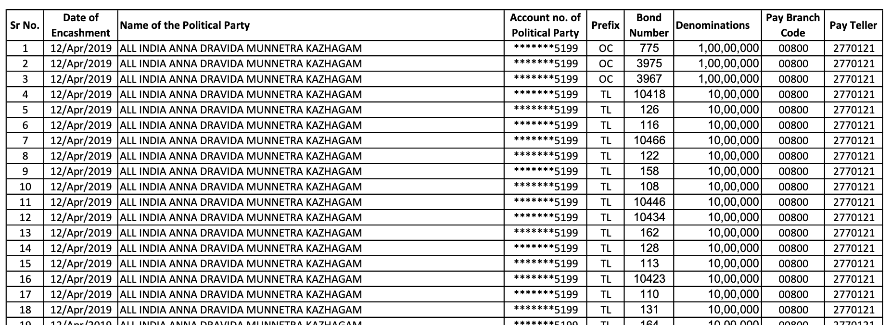
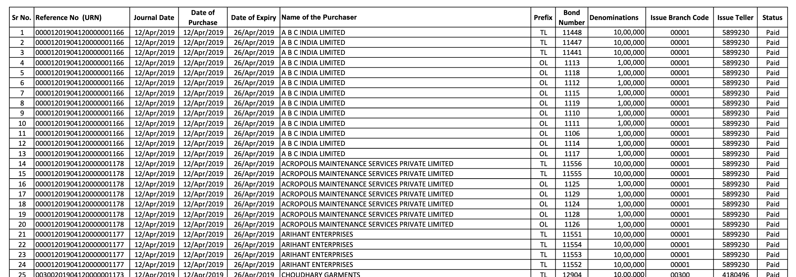
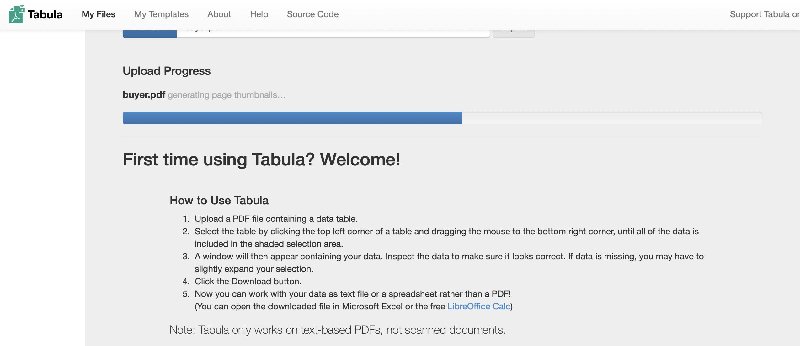
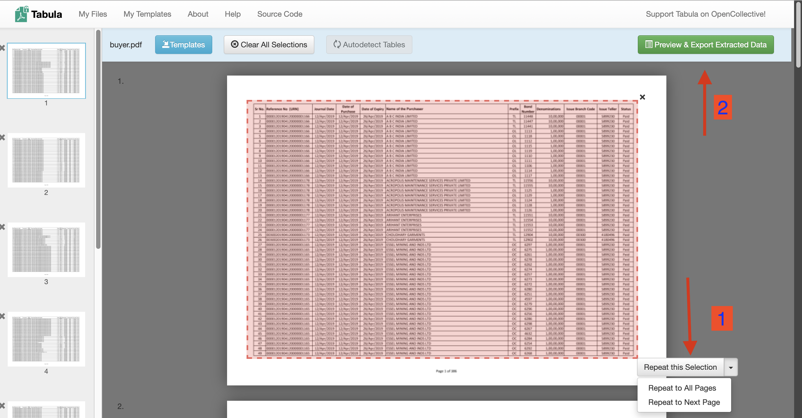

<!-- Intro -->

We will create the following folders/ directories to manage the files

1.  data

2.  data/raw (i.e. a folder titled 'raw' within the 'data' folder)

3.  data/processed (i.e. a folder titled 'raw' within the 'data' folder)

4.  fig

<!-- insert image of folder -->

To make code sharing easier and not have to check for directory, we will make the directory we are working in the working directory.

```{r}
#| label: Dir setup
library("here")
here()
```

### Step 1: Obtain files from election Commission of India (ECI)

Go to the [ECI](https://www.eci.gov.in/disclosure-of-electoral-bonds) website and download these files into your "data/*raw*" folder:

1.  *"Details of Electoral Bonds submitted by SBI on 21st March 2024 (EB_Redemption_Details)"* ➡️ \[**rename this file '*party.pdf'***\]

    {width="1800"}

2.  *"Details of Electoral Bonds submitted by SBI on 21st March 2024 (EB_Purchase_Details)"* ➡️ \[**rename this file '*buyer.pdf'***\]

    {width="1800"}

### Step 2: Convert files from pdf to data frame

We will use Tabula to convert the pdf to a table and data frame for further processing

-   Install [Tabula](https://tabula.technology/)

-   Open the zip folder installed

-   Open the Tabula application. It will open in a browser window

-   Browse ➜ select file ➜ import

    {width="1800"}

-   Select the table on page and then select from the drop down: 'Repeat this Selection/ Repeat to all Pages' ➜ 'Preview and Export the Extracted data'

    {width="1800"}

Export to 'data/raw' folder as csv. The files will be labelled **tabula_buyer.csv** & **tabula_party.csv**

### Step 3: Setting up packages for the cleaning

We will be using the following packages: dplyr, lubridate, stringr, tidyr, ggplot2

```{r}
#| label: package mgmt
#| warning: true
#| include: false
#| results: hide


pakg <- c("dplyr", "lubridate", "stringr", "tidyr", "ggplot2")

sapply(pakg, library, character.only = TRUE)

rm(pakg)

```

### Step 4: Starting the cleaning process

1.  Converting csv to data frame

    The csv will be saved and minimally processed. They will be saved in the 'data/processed' folder with the names **df_buyer, df_party**

    ```{r}
    #| label: csv to df 

    df_buyer <- read.csv("./data/raw/tabula_buyer.csv")
    df_party <- read.csv("./data/raw/tabula_party.csv")


    ```

2.  Saving as a data frame in the processed folder

    ```{r}
    save(df_buyer,file = "./data/processed/df_buyer.Rda")
    save(df_party,file = "./data/processed/df_party.Rda")
    ```

    👷 When you come back to work after a break, use the *load* function to start working on the data frame again.

    > pakg \<- c("dplyr", "lubridate", "stringr", "tidyr", "ggplot2", "here")
    >
    > sapply(pakg, library, character.only = TRUE)
    >
    > rm(pakg)
    >
    > here()
    >
    > \# get file path & use load function
    >
    > load("./\<path\>/data/processed/df_buyer.Rda")
    >
    > load( "./\<path\>/data/processed/df_party.Rda")

    The data frame can be saved using the save function

    > save(df_buyer, file = "./data/processed/df_buyer.Rda")
    >
    > save(df_party, file = "./data/processed/df_party.Rda")

3.  Checking data type

    Given below are 4 different ways of getting a flavor of the data type (*glimpse, head, str, class*).

    ```{r}

    glimpse(df_buyer)

    ```

    ```{r}
    head(df_buyer, 5)
    ```

    ```{r}

    str(df_party)

    ```

    ```{r}
    lapply(df_party, class)
    ```

4.  As the data is all in character type we will have to change each col to the type we require

    You will some warning messages (NA's introduced by coercion), we will come back to them later

    ```{r}
    # Integer values

    df_buyer <-   df_buyer |> 
        mutate(across(c(Sr.No., Bond.Number, Issue.Teller), as.integer))

    # Date

    df_buyer <-   df_buyer |> 
        mutate(Journal.Date = as.Date(Journal.Date, format = "%d/%b/%Y"), 
              Date.of.Purchase = as.Date(Date.of.Purchase, format = "%d/%b/%Y"),
              Date.of.Expiry = as.Date(Date.of.Expiry, format = "%d/%b/%Y"))

    # Money
    # The presence of commas is throwing off the conversion directly from char to numeric
    # Therefore, we remove the commas using gsub, and then convert the values

    df_buyer <- df_buyer |> 
        mutate(Denominations = as.integer(gsub(",","", Denominations)))

    ```

5.  Repeating the same for the df_party data frame

    ```{r}
    # Integer value
    df_party <- df_party |> 
        mutate(across(c(Sr.No., Bond.Number, Pay.Teller), as.integer))

    # Date
    df_party <-  df_party |> 
        mutate(Date.of.Encashment = as.Date(Date.of.Encashment, format = "%d/%b/%Y"))

    # Money 

    df_party <- df_party |> 
        mutate(Denominations = as.integer(gsub(",","",Denominations)))

    ```

6.  Making unique

    Duplicates are removed, by looking for duplicates along all variables. There is a unique serial number for each row, so no useful data should be removed by using the unique function.

    ```{r}

    df_buyer <-  unique(df_buyer)
    df_party <- unique(df_party)

    # Count duplicated rows

    sum(duplicated(df_buyer))
    sum(duplicated(df_party))
    ```

7.  Checking for data completeness in the csv files

    -- The buyer.pdf has 18871 rows

    -- The party.pdf has 20421 rows

    ```{r}

    print(paste(sum(is.na(df_party)),": NA in df_party"))
    print(paste(sum(is.na(df_buyer)),"NA in :df_buyer"))


    ```

See the rows that contain NA values

```{r}
df_buyer[!complete.cases(df_buyer), ]
```

Seeing for df_party as well

```{r}

df_party[!complete.cases(df_party), ]
```

9.  Remove header row from data

```{r}

df_buyer <- df_buyer |> 
    filter(!grepl("Reference", Reference.No...URN.))

df_buyer[!complete.cases(df_buyer), ]
```

For df_party

```{r}

df_party <- df_party |> 
    filter(!grepl("Name", Name.of.the.Political.Party))

df_party[!complete.cases(df_party), ]
```

9.  Identify the missing rows using Sr. No.

    We now have to find the missing rows. We can use the absence of a serial number (between 1:18871 for df_buyer and 1:20421 for df_party)

    ```{r}
    #| label: Missing rows: buyer

    miss_buyer <- setdiff(1:18871, df_buyer$Sr.No.)
    print(paste("Buyer Missing:",length(miss_buyer)))
    miss_buyer

    miss_party <- setdiff(1:20421, df_party$Sr.No.)
    print(paste("Party Missing:", length(miss_party)))
    miss_party

    rm(miss_party,miss_buyer)

    ```

10. Adding the missing rows to the party data frame

    This error of missing rows may not occur for everybody. In this case, i will be extracting and appending the data.

    On a review of the pdf on Tabula, it shows that pg 38 (Sr.No. 1370-1406 has not been extracted).

    ```{r}
    #| label: Missing party data

    df_miss_party <- read.csv("./data/raw/tabula_miss_party.csv")

    glimpse(df_miss_party)

    test_party <- df_party
    test_party <- rbind(test_party,df_miss_party)

    ```

    Simply using the rbind fn will give errors as we have made modifications to the data frame.

```{r}
# Integer value
df_miss_party <- df_miss_party |> 
    mutate(Sr.No.=  as.numeric(Sr.No., Bond.Number, Pay.Teller))

# Date
df_miss_party <-  df_miss_party |> 
    mutate(Date.of.Encashment = as.Date(Date.of.Encashment, format = "%d/%b/%Y"))

# Money 

df_miss_party <- df_miss_party |> 
    mutate(Denominations = as.integer(gsub(",","",Denominations)))

df_miss_party <- unique(df_miss_party)

str(df_miss_party)

test_party <- rbind(test_party,df_miss_party)

df_party <- test_party

rm(test_party)

```

9.  Merging the two data frames

Bond number is a unique identifier across both the df_party and df_buyer data frame. We will first find the difference between the bond numbers listed in both

```{r}
#| label: Bond number review

# str(df_buyer$Bond.Number, df_party$Bond.Number)

print ("Buyer purchased bonds not encashed")
bought_notcashed <- setdiff(df_buyer$Bond.Number,df_party$Bond.Number)
print(length(bought_notcashed))
bought_notcashed

rm(bought_notcashed)

# ------

print ("Party encashed bonds not in buyer")
cashed_notbought <- setdiff(df_party$Bond.Number, df_buyer$Bond.Number)
print(length(cashed_notbought))
sort(cashed_notbought)

rm(cashed_notbought)


```

Bonds purchased

```{r}
print(paste("Value bonds purchased", sum(df_buyer$Denominations)))

print(paste("Value bonds encashed", sum(df_party$Denominations)))

z <- (sum(df_buyer$Denominations)- sum(df_party$Denominations))
    
z

print(paste("Purchased - Encashed: ", z/10^7 , " crore"))

rm(z)
```

### Step 5: Merging the files

We want to create 2 separate data frames

-   Buyer and party mapped one-one based on matching of bond numbers + Bonds purchased but not encashed

-   Bonds encashed but there is no linked buyer party available

```{r}
#| label: merging files to keep all buyer details

df_merge_buyerParty <-  left_join(df_buyer,df_party[,c("Name.of.the.Political.Party", "Denominations", "Bond.Number", "Prefix")], by = c("Bond.Number", "Prefix"))

save(df_merge_buyerParty, file = "./data/processed/df_merge_buyerParty.Rda")

# We check if the buyer amount and party encashed amount are not matching
# They are matching. So we can proceed to the data frame cleanup operations

df_merge_buyerParty |> 
    filter(Denominations.x != Denominations.y)

df_merge_buyerParty <- subset(df_merge_buyerParty, select = -Denominations.y)

```

Creating the second data frame, of bonds encashed but there is no linked buyer party available

```{r}
#| label: bonds encashed but there is no linked buyer party

df_unknownBuyer <- anti_join(df_party, df_buyer, by = "Bond.Number",)


df_unknownBuyer |> 
    group_by(Bond.Number) |> 
    filter(n()>1)

# The difference in number with the earlier check 'cashed_notbought' arises due to the same bond number with different Prefix

```

### Step 6: Summarising party wise unknown buyer data

```{r}

df_unknownBuyer |> 
    group_by(Name.of.the.Political.Party) |> 
    summarise(amount_rcvd = sum(Denominations)) |> 
    arrange(desc(amount_rcvd))

# summarising by date and party

df_sum_unknownBuyer <- df_unknownBuyer |> 
    group_by(Name.of.the.Political.Party, Date.of.Encashment) |> 
    summarise(amount_rcvd = sum(Denominations)) |> 
    arrange(desc(amount_rcvd))

save(df_sum_unknownBuyer, file = "./data/processed/df_sum_unknownBuyer.Rda")

save(df_unknownBuyer, file = "./data/processed/df_unknownBuyer.Rda")


```

### Step 7: Cleaning Names

1.  Consolidating based on Names and Dates

2.  Cleaning variable/column names

3.  . followed by small case to be removed

    ```         
    names(frame) <- sub("\.$", "", names(frame))
    ```

4.  
